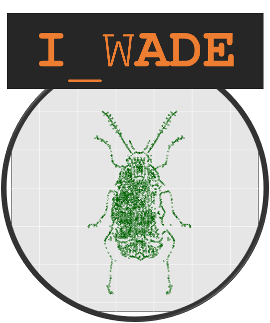

## &#x2690; Sobre
Esse evento tem como objeto primário o compartilhamento de experiências, a promoção da integração de pesquisa e a capacitação de pesquisadores em análise estatística de dados entomológicos, principalmente originários de experimentos agronômicos.

 

_____

## &#x1f4dd; Quando, onde e como
Dia 01/06/2021 das 08:00 às 12:00, pelo *Google Meet*. Esse evento é de caráter restrito, isto é, com participação limitada a convite e/ou manifestação de interesse, sendo esta última opção analisada pela organização.

_____

## &#x2714; Participantes confirmados
 
 | André Cirílo de Souza Almeida (IF Goiano - Campus Urutaí) |  | Anderson Rodrigo da Silva (IF Goiano - Campus Urutaí)
-----------|:------------------------------------------------------|:-----------|:------------------------------------------------------
 | José Alexandre de Freitas Barrigossi (Embrapa Arroz e Feijão) |  | Flávio Gonçalves de Jesus (IF Goiano - Campus Urutaí)

_____

## &#x1f4bb; Tópicos
- Modelos lineares generalizados para dados de contagem e dados inflacionados de zero
- Modelos para ensaios de dose-resposta (logit, probit e outros)
- Análise de sobrevivência
- Aplicações de análise multivariada em ecologia de insetos

_____

## &#9881; Organizadores
[Anderson Rodrigo da Silva](http://lattes.cnpq.br/3916683240962357), [André Cirílo de Souza Almeida](http://lattes.cnpq.br/7511716135317356), [José Alexandre de Freitas Barrigossi](http://lattes.cnpq.br/5377957113836597)

_____

## &#x272D; Promoção
Programa de Pós-Graduação em Proteção de Plantas - [Instituto Federal Goiano - Campus Urutaí](https://www.ifgoiano.edu.br/home/index.php/urutai)

_____

## &#x2709; Contato
<ppgpp.urt@ifgoiano.edu.br>
