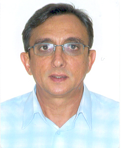

 

## &#x2690; 
Esse evento tem como objeto primário o compartilhamento de experiências, a promoção da integração de pesquisa e a capacitação de pesquisadores em análise estatística de dados entomológicos, principalmente originários de experimentos agronômicos.

 

## &#x1f4dd; Quando, onde e como?
Dia 01/06/2021 das 08:00 às 12:00, pelo *Google Meet*. Esse evento é de caráter restrito, isto é, com participação limitada a convite e/ou manifestação de interesse, sendo esta última opção condicionada a análise pela organização.

## &#x1f4bb; O que?

Tema    |  Resumo                                |  Apresentação
--------|:---------------------------------------|:------------------
Modelos lineares generalizados para dados de contagem e dados inflacionados de zero | Dados de contagem, como número de insetos por planta e proporção de insetos mortos, podem ser descritos por modelos lineares generalizados (GLM), com distribuições Poisson, binomial negativa ou outra. Não raramente esses dados se apresentam com excesso de zeros. Este e outros fenômenos experimentais causam falta de ajuste (superdispersão) nos GLM. Veremos como ajustar, interpretar e utilizar critérios objetivos para escolha acertada de GLM. | Anderson Rodrigo da Silva
Modelos para ensaios de dose-resposta (logit, probit e outros) | em breve... | à definir...
Análise de sobrevivência | em breve... | à definir...
Aplicações de análise multivariada em ecologia de insetos | em breve... | José Bruno Malaquias (Unesp - Botucatu)

## &#x2714; Participantes confirmados
 
 | André Cirílo de Sousa Almeida (IF Goiano - Campus Urutaí) |  | Anderson Rodrigo da Silva (IF Goiano - Campus Urutaí)
-----------|:------------------------------------------------------|:-----------|:------------------------------------------------------
 | José Alexandre de Freitas Barrigossi (Embrapa Arroz e Feijão) |  | Flávio Gonçalves de Jesus (IF Goiano - Campus Urutaí)
 | José Bruno Malaquias (Unesp - Botucatu) | ... |  ...

## &#9881; Organizadores
- [Anderson Rodrigo da Silva](mailto:anderson.silva@ifgoiano.edu.br)
- [André Cirílo de Sousa Almeida](mailto:andre.almeida@ifgoiano.edu.br)
- [José Alexandre de Freitas Barrigossi](mailto:jose.barrigossi@embrapa.br)

## &#x272D; Promoção
Programa de Pós-Graduação em Proteção de Plantas - [Instituto Federal Goiano - Campus Urutaí](https://www.ifgoiano.edu.br/home/index.php/urutai)

## &#x2709; Contato
E-mail: <ppgpp.urt@ifgoiano.edu.br>
