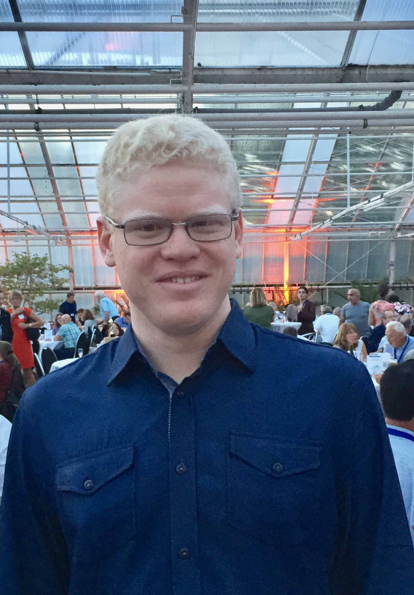

 

## &#x2690; 
Esse evento tem como objeto primário o compartilhamento de experiências, a promoção da integração de pesquisa e a capacitação de pesquisadores em análise estatística de dados entomológicos, principalmente originários de experimentos agronômicos.

 

## &#x1f4dd; Quando, onde e como?
Dia 01/06/2021 das 08:00 às 12:00, pelo *Google Meet*. Esse evento é de caráter restrito, isto é, com participação limitada a convite (RSVP) e/ou manifestação de interesse, sendo esta última opção condicionada a análise pela organização.

  
Screenshots &#128247;

  
  
  
 
 
 
 
 
 
 
 
 

## &#x1f4bb; O que?

Tema    |  Resumo                                |  Apresentação
--------|:---------------------------------------|:------------------
Análise de *probit* para determinação de dose/concentração letal em experimentos entomológicos | Em análise de dados de sensibilidade, particularmente em ensaios de dose-resposta, o método mais utilizado é a análise de probit (Bliss, 1935).  Esta análise, também conhecida como regressão de Probit (que significa unidade probabilística), é baseada na probabilidade acumulativa de uma distribuição normal. Este tipo de análise é apropriado para conjuntos de dados em que a variável dependente é binomial e medida em unidades do tipo sim ou não, morreu ou não morreu, teve ou não o efeito esperado. Os dados crus de percentual de mortalidade são corrigidos (Abbott, 1925) e transformados em probit units.  As doses são transformadas em escala logarítmica. A equação da reta resultante é usada para estimar doses críticas.  As estimativas mais robustas (com menores intervalos de confiança) são as doses letais ou doses efetivas 50% (DL50 ou DE50), ou seja, doses que causam mortalidade (ou outro efeito de interesse) em 50% dos indivíduos testados (N/2). A estatística utilizada para verificar o ajuste dos dados ao modelo de probit é o teste de Qui-quadrado, que consiste em verificar se as mortalidades observadas e esperadas são condizentes.  Serão discutidas considerações importantes sobre o planejamento experimental, a relação de dose-resposta, a análise e a interpretação dos resultados. | Dra. Paula Marçon/Dra. Janayne Rezende
Análise de tabelas de vida  e fertilidade | O potencial de crescimento de populações de insetos é uma informação fundamental em estudos de dinâmica populacional. Dados relacionados à reprodução e mortalidade, utilizados para estimar o crescimento de populações, são usualmente condensados em tabelas denominadas tabelas de vida e fertilidade (TBVF). Os principais parâmetros associados a essas tabelas são: a) Taxa líquida de reprodução (Ro), b) Taxa intrínseca de crescimento (Rm), c) Intervalo médio entre gerações (Mgt) e d) Razão finita de crescimento (λ). Para comparar o potencial de crescimento de duas ou mais populações, realizam-se experimentos para obtenção dos dados de sobrevivência e fertilidade utilizados na construção das TBVF. Usualmente, nesses experimentos, utiliza-se o delineamento inteiramente casualizado, no qual cada inseto constitui uma unidade experimental. Assim, cada tratamento é aplicado a um grupo de insetos, sem repetição de grupo. Para calcular a variância da estimativa de qualquer parâmetro de uma TBVF são utilizadas as técnicas ‘jackknife’ ou  ‘bootstrap’. Como são técnicas computacionalmente intensivas, sua aplicação exige o desenvolvimento de algoritmos eficazes e sua implementação através de uma linguagem de programação que garanta rapidez e confiabilidade aos cálculos. Discutiremos aspectos como a utilidade das tabelas de vida, sua construção e interpretação. Serão apresentados programas estatísticos em linguagem R e SAS desenvolvidos especificamente para esse tipo de análise. | Dra. Aline de Holanda Nunes Maia
Abordagem multivariada como ferramenta para compreensão da dinâmica populacional de pragas e inimigos naturais | Em estudos envolvendo interações tróficas de insetos-praga e seus predadores/parasitoides, análises multivariadas baseadas em PCA, agrupamento, escalonamento multidimensional e permanova possibilitam a exploração de ligações estruturais que envolvem um grande número de variáveis, permitindo também meios de classificação do habitat e da estrutura do agroecossistema. Serão apresentados potenciais aplicações dessas técnicas. [Resumo](Resumo-Multivariada-BrunoJessica.pdf) | Dr. José Bruno Malaquias (Unesp - Botucatu), MSc. Jéssica Pachú (Esalq/USP)
Modelos lineares generalizados para dados de contagem e dados inflacionados de zero | Dados de contagem, como número de insetos por planta e proporção de insetos mortos, podem ser descritos por modelos lineares generalizados (GLM), com distribuições Poisson, binomial negativa ou outra. Não raramente esses dados se apresentam com excesso de zeros. Este e outros fenômenos experimentais causam falta de ajuste (superdispersão) nos GLM. Veremos como ajustar, interpretar e utilizar critérios objetivos para escolha acertada de GLM. [Slides](GLM.html) | Prof. Dr. Anderson Rodrigo da Silva

## &#x2714; Participantes confirmados
 
 | André Cirílo de Sousa Almeida (IF Goiano - Campus Urutaí) |  | Anderson Rodrigo da Silva (IF Goiano - Campus Urutaí)
-----------|:------------------------------------------------------|:-----------|:------------------------------------------------------
 | José Alexandre de Freitas Barrigossi (Embrapa Arroz e Feijão) |  | Flávio Gonçalves de Jesus (IF Goiano - Campus Urutaí)
 | José Bruno Malaquias (Unesp - Botucatu) |  | Jéssica Karina da Silva Pachú (Esalq/USP)
 | Paula Marçon (AgBiTech) |  | Janayne Maria Rezende (AgBiTech)
 | Tavvs Micael Alves (IF Goiano) |  | José Ednilson Miranda (Embrapa Algodão)
 | Aline de Holanda Nunes Maia (Embrapa Meio Ambiente) |

## &#9881; Organizadores
- [Anderson Rodrigo da Silva](mailto:anderson.silva@ifgoiano.edu.br)
- [André Cirílo de Sousa Almeida](mailto:andre.almeida@ifgoiano.edu.br)
- [José Alexandre de Freitas Barrigossi](mailto:jose.barrigossi@embrapa.br)

## &#x272D; Promoção
  

## &#x2709; Contato
E-mail: <ppgpp.urt@ifgoiano.edu.br>
